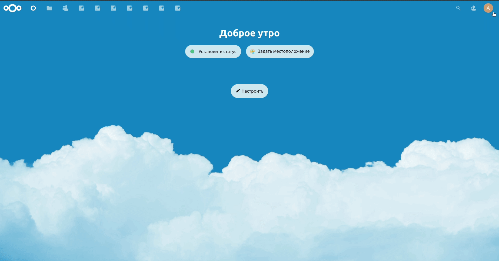
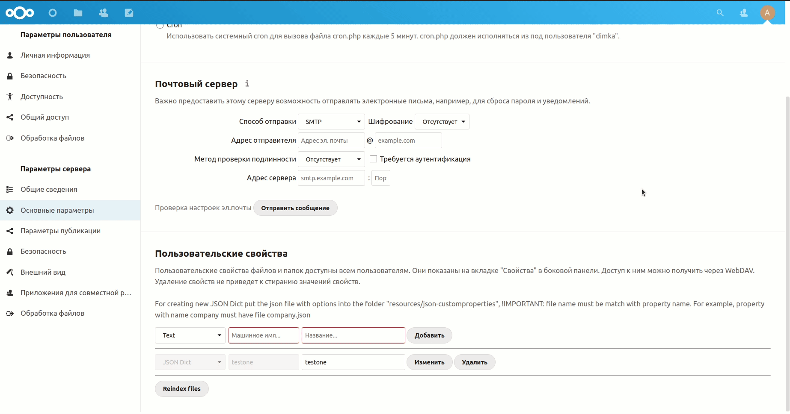
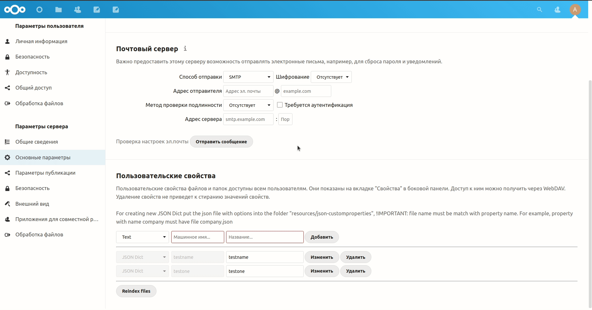
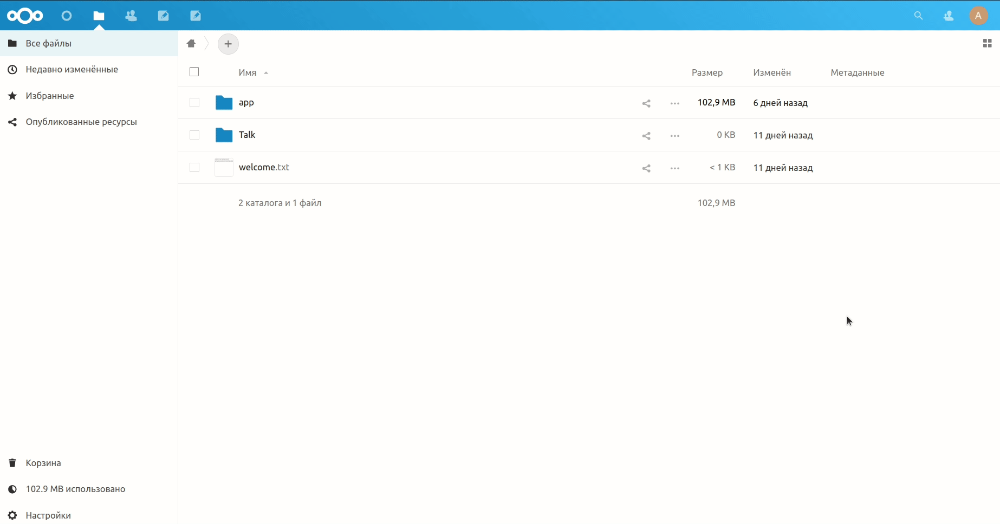

# Подготовка

Требования:
- nextcloud 22.2.3
    - node 15, установленная глобально
    - python 3.8
    - apache

Разрешаем www-data подключаться к пользователю и запускать процессы. Открываем:

    sudo visudo -f /etc/sudoers.d/custom
    
 Добавляем строку:
  
    www-data ALL=(user:user) NOPASSWD:ALL  
     
 Далее добавляем пользователя в группу www-data:
 
    sudo usermod -aG www-data user
    
 Разрешаем изменения в папке приложений:
 
     chmod -R g+w nextcloud/apps
     
 Устанавиливаем группу для новых файлов по умолчанию:
 
     chmod g+s /nextcloud   
     
# Установка 

Клонируем приложение-словарь в папку customprop_dict: 
      
      cd nextcloud/apps
      git clone https://github.com/antonioiksi/nextcloud-customprop_dict.git customprop_dict
      
Клонируем основное приложение ветки feature-filestable-and-select-cp в папку customproperties: 
  
      cd nextcloud/apps
      git clone https://github.com/antonioiksi/nextcloud-customproperties.git -b feature-filestable-and-select-cp customproperties
      
Компилируем приложение
   
      cd nextcloud/apps/customproperties
      ./build.sh
  
Активируем установленное приложение:
    
        php occ app:enable customproperties
        
# Работа с приложением

Нажимаем на аватар пользователя в правом верхнем углу и выбираем настройки. Далее в "Параметры сервера" находим "Основные параметры" и прокручиваем до "Пользовательские свойства":

В первом выпадающем меню выбираем "JSON Dict", далее вводим имя и название. Они должны состоять из одного слова, маленькими буквами, без использования цифр. После следует нажать "Добавить" и дождаться создания словаря. После обновления страницы вверху в панели приложений появится новое, с введеным названием:

В созданном приложении следует ввести теги, необходимые для последующего использования. Для создания нового тега следует нажать на "New element", ввести название и описание, после чего нажать кнопку сохранить:

После этих действий в метаданных каждого файла появится новое пользовательское свойство с тегами, записанными нами в приложении:

