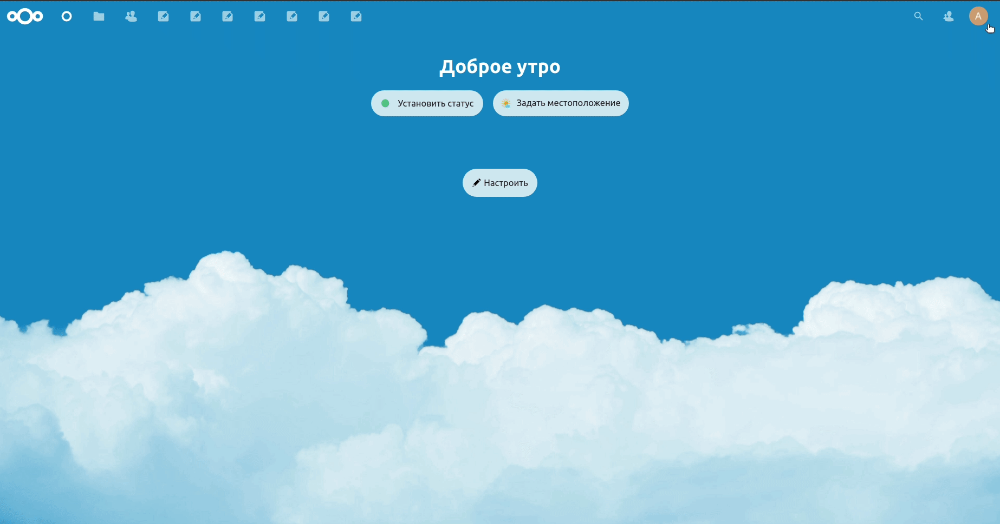
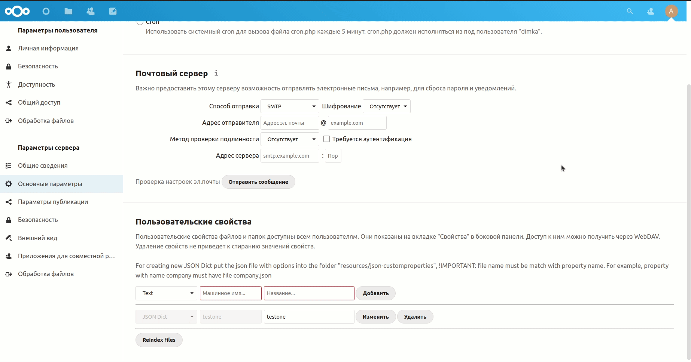
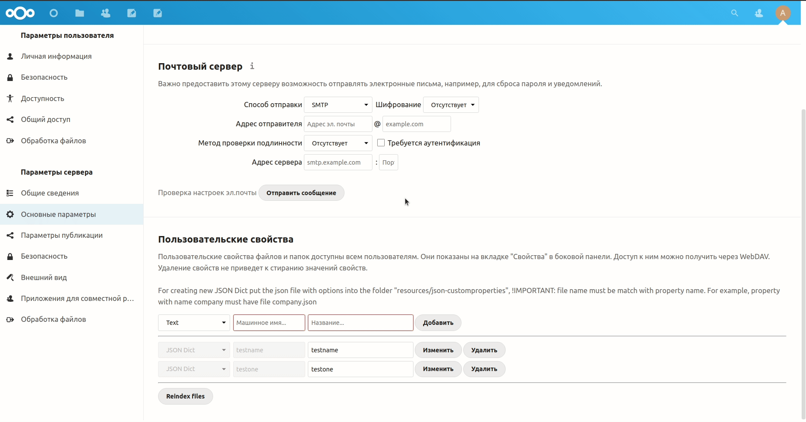
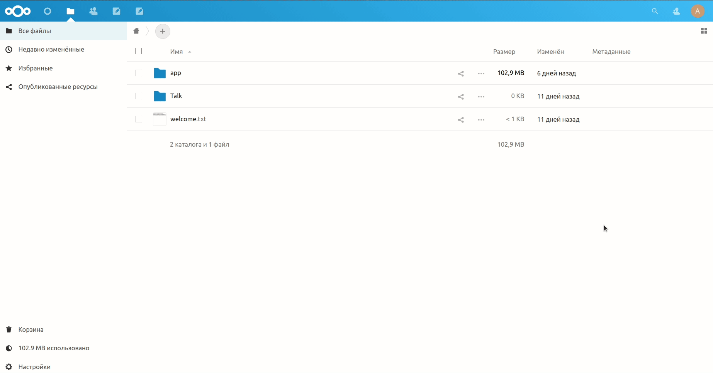

# Prepare

Requirements:
- nextcloud 22.2.3
    - node 15, installed globally
    - python 3.8
    - apache

Allow "www-data" to connect to the user and start processes. Open:

    sudo visudo -f /etc/sudoers.d/custom
    
Add a line:
  
    www-data ALL=(user:user) NOPASSWD:ALL  
     
 Next, add the user to the www-data group:
 
    sudo usermod -aG www-data user
    
 Allow changes in the applications folder:
 
     chmod -R g+w nextcloud/apps
     
 Set the default group for new files:
 
     chmod g+s /nextcloud   
     
# Installing

Clone the dictionary application into the customprop_dict folder: 
      
      cd nextcloud/apps
      git clone https://github.com/antonioiksi/nextcloud-customprop_dict.git customprop_dict
      
Clone the main application of the feature-filestable-and-select-cp branch into the customproperties folder: 
  
      cd nextcloud/apps
      git clone https://github.com/antonioiksi/nextcloud-customproperties.git -b feature-filestable-and-select-cp customproperties
      
Compiling the application
   
      cd nextcloud/apps/customproperties
      ./build.sh
  
Activate the installed application:
    
        php occ app:enable customproperties
        
# Working with the app

Click on the user's avatar in the upper right corner and choose settings. Then under "Server Settings" find "Basic Settings" and scroll to "User Properties":

In the first drop-down menu, choose "JSON Dict", then enter a name and a title. They should consist of one word, in small letters, without using numbers. After that, you should click "Add" and wait for the dictionary to be created. After refreshing the page at the top of the application panel will appear a new one, with the entered name:

In the created application, you should enter the tags you need for later use. To create a new tag, click on "New element", enter the name and description, and then click save:
In the first drop-down menu, choose "JSON Dict", then enter a name and a title. They should consist of one word, in small letters, without using numbers. After that, you should click "Add" and wait for the dictionary to be created. After refreshing the page at the top of the application panel will appear a new one, with the entered name:

After these steps, a new custom property appears in the metadata of each file with the tags we recorded in the application:

